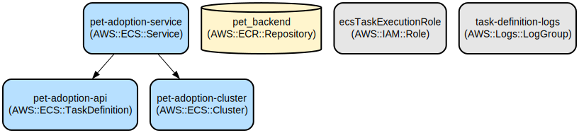

# Pet Adoption API: A Secure and Scalable Backend for Pet Management

The Pet Adoption API is a robust Node.js backend service that enables pet adoption platforms to manage pets, users, and adoption processes. It provides secure authentication, comprehensive pet management, and seamless integration with AWS infrastructure for reliable deployment and scaling.

The application is built using Express.js and MongoDB, featuring JWT-based authentication, role-based access control, and RESTful endpoints for pet and user management. It includes advanced search capabilities for pets, supports multiple adoption statuses (available, fostered, adopted), and implements industry-standard security practices. The service is containerized using Docker and deployed on AWS ECS with automated CI/CD pipelines.

## Repository Structure
```
.
├── controllers/           # Request handlers for pets, users, and authentication
├── routes/               # API route definitions and endpoint configurations
├── services/            # Business logic and data access layer
├── schema/             # JSON validation schemas for data integrity
├── utils/              # Shared utilities for auth, database, and error handling
├── .github/workflows/  # CI/CD pipeline configurations
├── docker-compose.yml  # Local development container orchestration
├── Dockerfile         # Container build instructions
├── index.js          # Application entry point
└── task-definition.json  # AWS ECS task configuration
```

## Usage Instructions
### Prerequisites
- Node.js v18.x or later
- MongoDB instance (local or cloud)
- Docker (for containerized deployment)
- AWS account (for production deployment)

### Installation
```bash
# Clone the repository
git clone <repository-url>
cd pet-adoption-api

# Install dependencies
npm install

# Set up environment variables
cp .env.example .env
# Edit .env with your configuration

# Start the application
npm start
```

### Quick Start
1. Start the server:
```bash
npm start
```

2. Create a new user:
```bash
curl -X POST http://localhost:5050/auth/signup \
  -H "Content-Type: application/json" \
  -d '{
    "firstname": "John",
    "lastname": "Doe",
    "email": "john@example.com",
    "password": "securepassword",
    "phonenumber": "1234567890"
  }'
```

3. Login to get JWT token:
```bash
curl -X POST http://localhost:5050/auth/login \
  -H "Content-Type: application/json" \
  -d '{
    "email": "john@example.com",
    "password": "securepassword"
  }'
```

### More Detailed Examples
1. Add a new pet:
```bash
curl -X POST http://localhost:5050/pets \
  -H "Authorization: <your-jwt-token>" \
  -H "Content-Type: application/json" \
  -d '{
    "name": "Max",
    "type": "Dog",
    "adoptionStatus": "Available",
    "height": "40",
    "weight": "25"
  }'
```

2. Search pets by criteria:
```bash
# Basic search
curl http://localhost:5050/pets/search/basic?q=Dog

# Advanced search
curl http://localhost:5050/pets/search/advanced?q=Available
```

### Troubleshooting
1. MongoDB Connection Issues
- Error: "MongoDB Connection Error"
  - Verify MongoDB URI in .env file
  - Check MongoDB service status
  - Ensure network connectivity
  - Command: `mongo --eval "db.serverStatus()"`

2. Authentication Errors
- Error: "Not authorized"
  - Verify JWT token expiration
  - Check token format in Authorization header
  - Debug command: `curl -v -H "Authorization: <token>" http://localhost:5050/pets`

3. Container Issues
- Error: "Container failed to start"
  - Check Docker logs: `docker logs pet-application`
  - Verify port mappings
  - Ensure environment variables are set

## Data Flow
The application follows a layered architecture where requests flow through authentication middleware, routes, controllers, and services before interacting with the MongoDB database.

```ascii
Client Request → Authentication Middleware → Routes → Controllers → Services → MongoDB
     ↑                                                                           ↓
     └───────────────────────── JSON Response ────────────────────────────────←─┘
```

Key component interactions:
1. Authentication middleware validates JWT tokens and attaches user context
2. Routes direct requests to appropriate controllers
3. Controllers handle request/response logic and call services
4. Services implement business logic and database operations
5. MongoDB handles data persistence with proper indexing
6. Error handling occurs at each layer with consistent formatting
7. Responses are standardized across all endpoints

## Infrastructure


### Lambda Functions
- Type: AWS ECS Task
- Name: pet-adoption-api
- Purpose: Runs the containerized API service

### Networking
- VPC Configuration: AWS VPC with public and private subnets
- Load Balancer: Application Load Balancer for HTTP traffic
- Security Groups: Restricted access to container ports

### Container Registry
- ECR Repository: pet_backend
- Region: us-east-1
- Image Tag Strategy: Latest tag for production deployments

## Deployment
### Prerequisites
- AWS CLI configured with appropriate permissions
- Docker installed and configured
- Access to AWS ECR repository

### Deployment Steps
1. Build and test locally:
```bash
docker-compose up --build
```

2. Push to ECR:
```bash
aws ecr get-login-password --region us-east-1 | docker login --username AWS --password-stdin <aws-account-id>.dkr.ecr.us-east-1.amazonaws.com
docker build -t pet_backend .
docker tag pet_backend:latest <aws-account-id>.dkr.ecr.us-east-1.amazonaws.com/pet_backend:latest
docker push <aws-account-id>.dkr.ecr.us-east-1.amazonaws.com/pet_backend:latest
```

3. Update ECS service:
```bash
aws ecs update-service --cluster pet-adoption-cluster --service pet-adoption-service --force-new-deployment
```